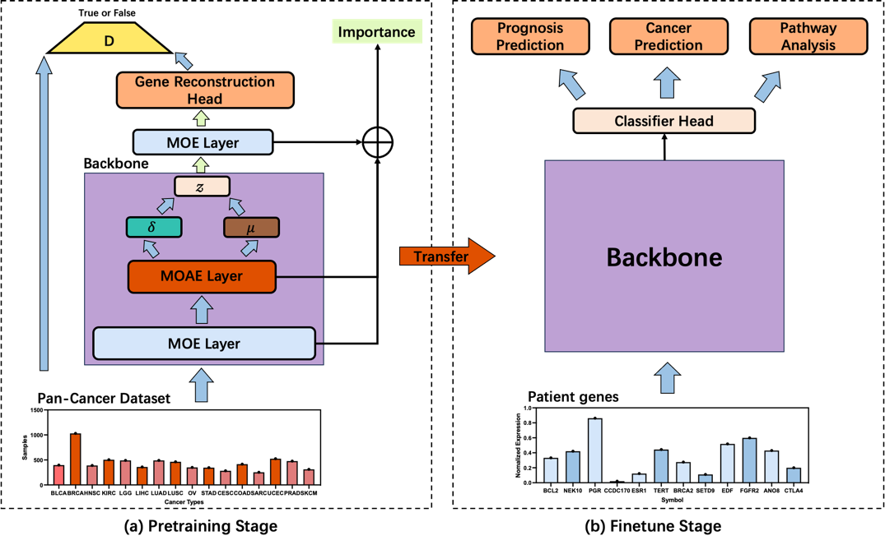

# Gene-MOE

Gene-MOE: A Sparsely Gated Genomic Analysis Framework exploiting Pan-Cancer data.

## Gene-MOE Architecture



## Install

### Requirements

* Python 3
* Pytorch 1.8.1 or higher
* Install numpy, tqdm, scikit-learn, imblearn, pandas and lifelines
```
pip install numpy
pip install tqdm
pip install scikit-learn
pip install pandas
conda install -c conda-forge imbalanced-learn
conda install -c conda-forge lifelines
```

## data prepare 

In this work, we mainly use the TCGA dataset from Xena. A detailed prepare process was

```
Rscript prepare.r
python convertcsv2hdf5_new.py
```

## Run Weight Reduction

```
python train_encoder.py
```

## Run Survival Analysis
```
python train_cox.py
```


## Run Cancer Classification
```
python train_classifer.py
```

## dataset

All the datasets we used in this experiment was available at [Xena](https://xenabrowser.net/datapages/)

